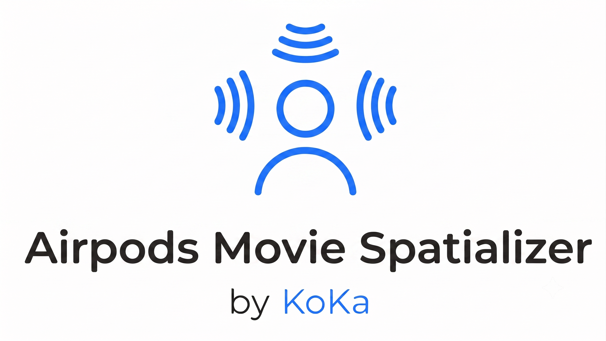
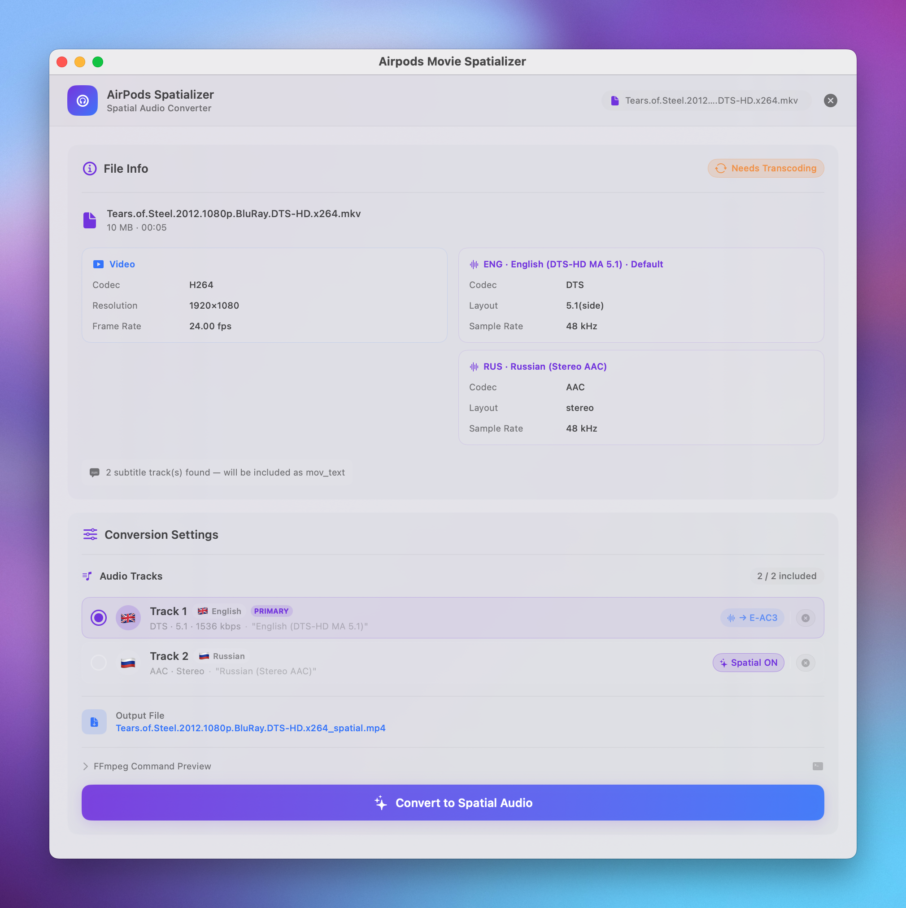

# AirPods Movie Spatializer

<p align="center">
  
</p>

<p align="center">
  <a href="https://developer.apple.com/xcode/swiftui/"></a>
  <a href="https://ffmpeg.org/"></a>
  <a href="LICENSE"></a>
</p>

A native macOS application designed to prepare video files for Apple Spatial Audio. It remuxes videos to MP4, preserving video quality entirely while transcoding incompatible audio streams (like DTS or TrueHD) to E-AC3 (Dolby Digital Plus), enabling Spatial Audio virtualization on your AirPods.

Available in 🇬🇧 English, 🇷🇺 Русский, and 🇺🇦 Українська.

---

<p align="center">
  
</p>

---

## Features

- **Smart Remuxing**: Direct video stream copy (`-c:v copy`). Zero quality loss, fast execution.
- **Multi-Track Audio Selection**:
  - Automatically lists all audio streams.
  - Enable or disable individual tracks.
  - Custom strategy recommendations per stream.
- **DTS / DTS-HD / TrueHD Support**: Transcodes raw theatrical formats to high-quality E-AC3 (Dolby Digital Plus) compatible with Apple devices.
- **Dolby Atmos Preservation**: Copies consumer E-AC3 Atmos tracks untouched to retain Dolby Atmos spatial object metadata.
- **5.1 Upmixing**: Force spatial upmix for stereo tracks (stereo → 5.1 surround using FFmpeg's surround filter) to trigger AirPods Spatial Audio.
- **Smart Subtitle Handling**: Bundles compatible text subtitle tracks (`SRT`, `ASS/SSA`, `VTT`) as `mov_text` with ISO language tags and track titles for QuickTime Player compatibility.
- **Finder Integration**: Appears in Finder's **"Open With..."** context menu for `.mkv`, `.mp4`, `.mov`, and `.avi` files, with `onOpenURL` file launch support.
- **FFmpeg Path Configuration**: Auto-detects local FFmpeg/FFprobe binaries (Homebrew, MacPorts, system paths) and allows manual configuration.
- **Instant Language Selector**: Switch interface language between English, Russian, and Ukrainian dynamically within app settings.

---

## Requirements

- **macOS 13.0 (Ventura)** or newer.
- **FFmpeg & FFprobe** binaries.
  - You can install them easily via Homebrew:
    ```bash
    brew install ffmpeg
    ```

---

## Installation & Setup

1. **Clone the repository:**
   ```bash
   git clone https://github.com/vlad/Airpods-Movie-Spatializer.git
   cd "Airpods Movie Spatializer"
   ```
2. **Open the Xcode project:**
   ```bash
   open "Airpods Movie Spatializer.xcodeproj"
   ```
3. **Build & Run (`Cmd + R`)** in Xcode.
4. **Configure binaries on first launch:**
   - The app will automatically prompt you to select your FFmpeg/FFprobe binaries or auto-detect them if installed via Homebrew.
   - If macOS blocks execution with a quarantine message, click the **"Remove Quarantine"** button in Settings.

---

## Architecture

The project is structured logically around the Model-View-Controller/Manager pattern:

- **Managers**:
  - `Managers/FFmpegManager.swift` - Core orchestrator for FFmpeg commands, progress piping, metadata probing, and subtitle stream mapping.
  - `Managers/AppSettings.swift` - Persists path configurations and user language overrides in `UserDefaults`.
- **Models**:
  - `Models/MediaInfo.swift` - Structs mapping metadata parsed from `ffprobe` output (video, audio, and subtitle streams).
  - `Models/ConversionJob.swift` - Maps audio tracks selection state and determines optimal conversion strategies.
- **Views**:
  - `Views/DropZoneView.swift` - File landing zone supporting system file drop and file pickers.
  - `Views/MediaInfoView.swift` - Informative summary of video resolution, fps, codecs, and compatibility.
  - `Views/ConversionSettingsView.swift` - Polished track-by-track toggle list with strategy cards and FFmpeg command previews.
  - `Views/ConversionProgressView.swift` - Live progress ring with detailed operation logs.
  - `Views/SettingsView.swift` - Quarantine removal tools, binary validation, and custom language tile selection grid.
  - `Views/DesignSystem.swift` - Premium glassmorphism components, gradients, and buttons.
- **Configuration**:
  - `Info.plist` - Declares `CFBundleDocumentTypes` for video file formats (`.mkv`, `.mp4`, `.mov`, `.avi`) for macOS LaunchServices integration.

## License

MIT License. See [LICENSE](LICENSE) for details.
